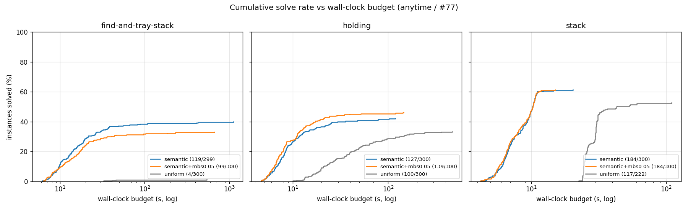
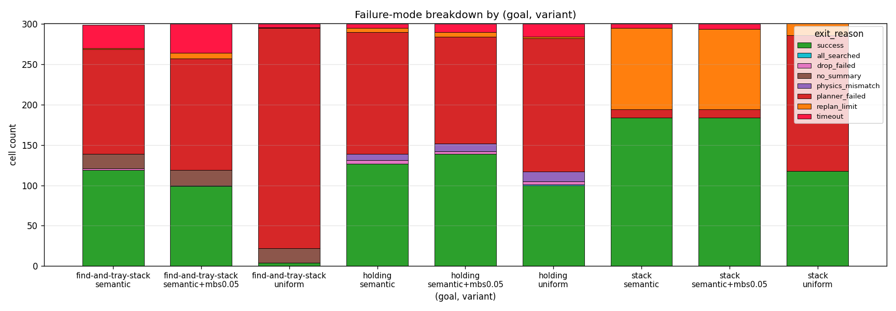
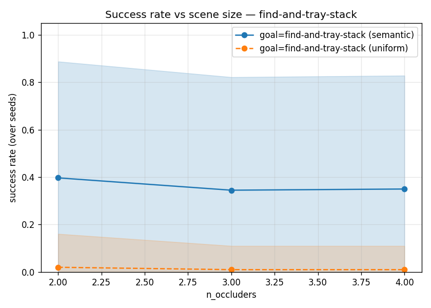
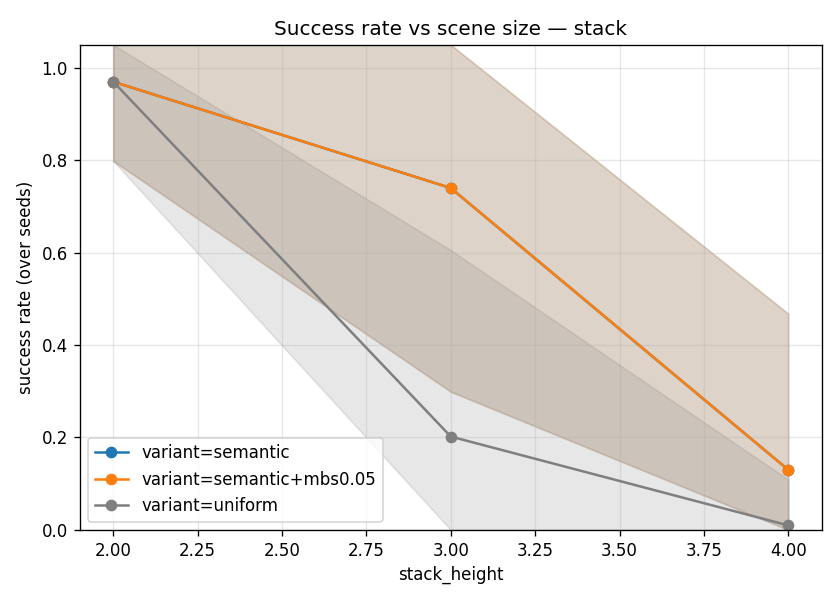
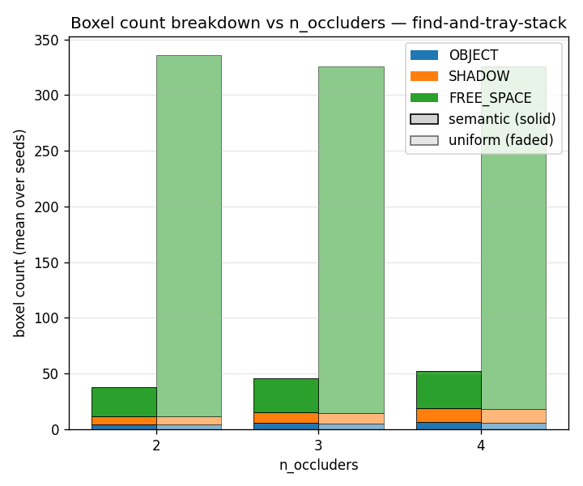
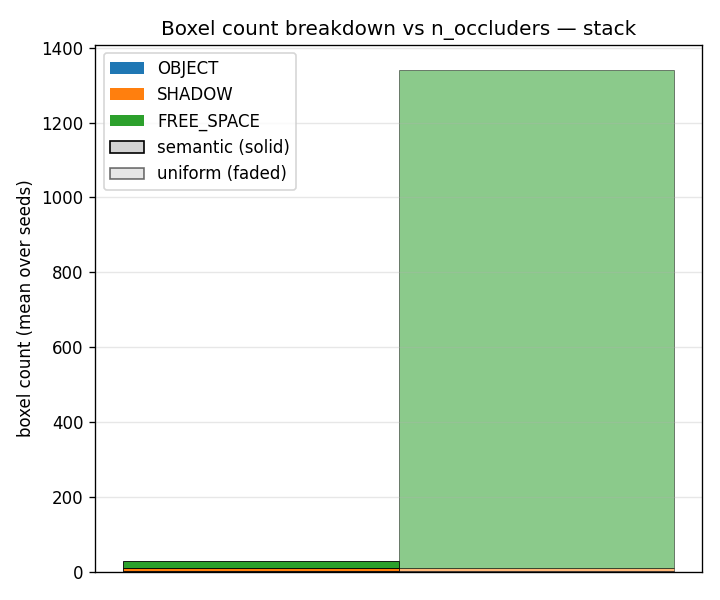
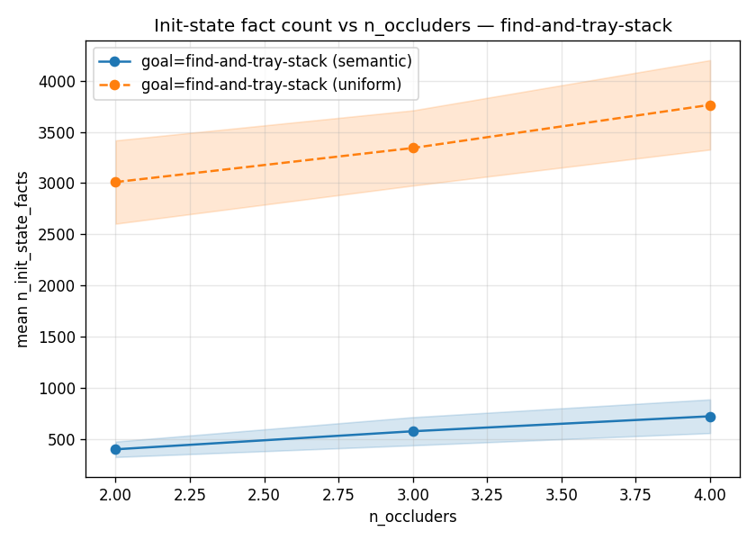
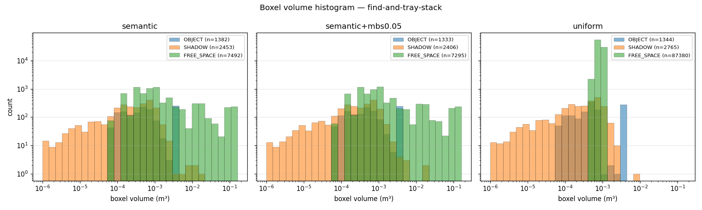
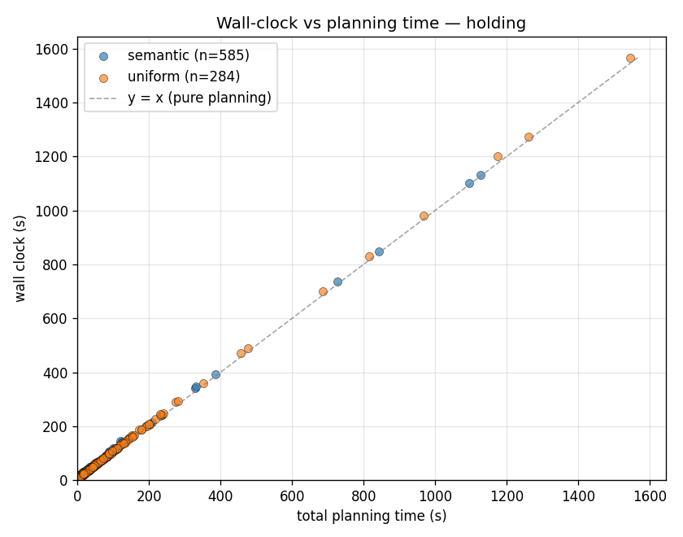
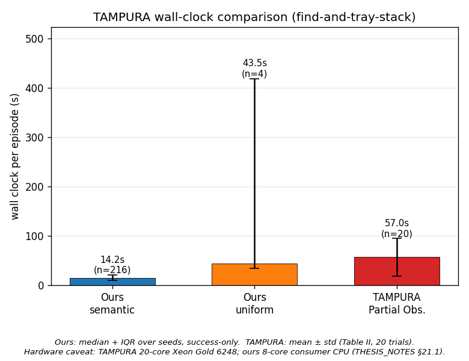

# Eval Summary — `sweep_anytime` (#77 SCALABILITY_VS_TIME)

This file is the human-readable narrative on top of the headline
artefacts in `eval_results/sweep_anytime/`.  It catalogues every plot
and table that the sweep produced, explains how to read each one, then
walks through the findings the data supports with the corresponding
plot inline as evidence.

> **Status (2026-05-20).**  Full sweep, 2700 / 2700 planned cells; 2534
> cells have full `run_config` parsed (the remaining 166 are
> timeout / no_summary / crash failure stubs with no init-state
> captured — see § Caveats).  The 5 ModuleNotFoundError cells from
> audit #96 have already re-run clean and are folded into the 2534.
> Three planner configurations × three goals × the 100-seed
> audit-#77 corpus.

---

## Contents

1. [What was run](#1-what-was-run)
2. [Plot catalogue](#2-plot-catalogue) — every PNG, what it is, how to read it
3. [Headline numbers](#3-headline-numbers)
4. [Findings with evidence](#4-findings-with-evidence)
5. [Caveats and open questions](#5-caveats-and-open-questions)
6. [File index](#6-file-index)

---

## 1. What was run

**Matrix preset:** `SCALABILITY_VS_TIME` ([eval_runner.py:162](eval_runner.py:162)),
defined for audit #77's anytime curve.  Four sub-matrices crossed:

| sub-matrix | scene | goals | baselines | mbs values | seeds |
|---|---|---|---|---|---|
| random-pairs / occluder-driven | `random-pairs` | `holding`, `find-and-tray-stack` | `semantic` | `{None, 0.05}` | corpus × 100 |
| random-pairs / uniform baseline | `random-pairs` | same | `uniform` | (forced auto_cell, #66) | corpus × 100 |
| stack / semantic | `stack` | `stack` | `semantic` | `{None, 0.05}` | corpus × 100 |
| stack / uniform baseline | `stack` | `stack` | `uniform` | (forced auto_cell) | corpus × 100 |

**Difficulty axis** is `n_occluders ∈ {2, 3, 4}` for the random-pairs
goals and `stack_height ∈ {2, 3, 4}` for the stack goal (the matrix
preset names both `n_occluders`; audit #95 introduced the per-row
`_row_difficulty` helper so plots and tables now report the right
axis).

**Three planner configurations** ("variants") emerge from the
`baseline × min_boxel_size` cross:

- **`semantic`** — octree + cell-merger free-space partition, leaf size
  clamped to the audit-#67 `auto_cell` floor (≈ 9 cm random-pairs,
  ≈ 6 cm stack).  This is the canonical "ours".
- **`semantic+mbs0.05`** — same pipeline with `--min-boxel-size 0.05`,
  forcing a 5 cm leaf floor below `auto_cell`.  The audit-#77
  hypothesis test.
- **`uniform`** — strict uniform 3-D grid (`uniform_grid.py`,
  audit #10), `--uniform-cell-size 0.05` clamped up to `auto_cell` per
  audit #66.  Reference baseline.

**Time budget** is a global `--max-plan-time 1800 s` per PDDLStream
`solve()` call (run_logger.py:519).  No matrix-axis on the budget;
shorter budgets are post-processed off `wall_clock_s`.

**Cells per variant per goal:** 3 difficulty points × 100 corpus seeds
= 300 cells, yielding 2700 planned cells total.

---

## 2. Plot catalogue

All paths are relative to `eval_results/sweep_anytime/`.

### 2.1 Cumulative-solve curves (the anytime story)

#### `solved_vs_time.png` — IPC-style cumulative solves vs wall-clock



One subplot per goal.  X is the wall-clock budget on a log scale to
the 1800 s cap; Y is the percentage of cells solved within that
budget.  Three lines per panel — `semantic`, `semantic+mbs0.05`,
`uniform`.  The right plateau equals each variant's overall
success rate.  The X-distance to the plateau is where reading the
"finer resolution wins under fixed budget" hypothesis would land
if it held.

`solved_vs_time_linear.png` is the same curve on a linear X axis;
useful for reading absolute budgets but compresses the
sub-100 s detail.

### 2.2 Per-goal aggregate plots

For each goal `G ∈ {holding, find-and-tray-stack, stack}` the
plotter writes:

#### `success_rate_vs_n_occluders__<G>.png`

Mean success rate by `(variant, difficulty)`.  Three lines per panel;
shaded ±1 std band over seeds; per-point `n` annotated when small.
The X-axis label switches to `stack_height` for the stack goal
(audit #95).

#### `planning_time_vs_n_occluders__<G>.png`

Mean `total_planning_time_s` over **successful** seeds.  Same axes
shape.  Success-only by construction — failed cells often have no
`total_planning_time_s` (no_summary / timeout stubs) and including
them mixes "ran to plan in 1.5 s" with "spent 30 min hitting a wall."

#### `init_state_facts_vs_n_occluders__<G>.png`

Mean number of PDDL init-state facts produced by `_build_init`,
including failed runs.  Proxy for grounding cost; THESIS_NOTES §14
cites this as the dominant planning-cost driver.

#### `boxel_count_breakdown__<G>.png`

Stacked bars OBJECT / SHADOW / FREE_SPACE per difficulty, grouped
by variant.  semantic bars solid, semantic+mbs0.05 hatched (`//`),
uniform faded.  Headline figure for the compactness pillar.

#### `boxel_volume_histogram__<G>.png`

Per-variant histogram (one panel each) of every boxel's volume in
m³ across all cells; log X (volumes span 4 decades), log Y (uniform
spikes ~10^5, semantic distributions ~10^3).  Heterogeneity proof.

#### `boxel_evolution_per_replan__<G>.png`

Mean OBJECT / SHADOW / FREE_SPACE count per `plan_index` across
cells, one panel per variant.  Shaded ±1 std band.  Shows whether
the partition mutates between replans (semantic should drift as
shadows resolve; uniform is approximately flat by construction).

#### `per_call_planning_time__<G>.png`

Mean `per_call_planning_time_s` per `plan_index`, one line per
variant.  Diagnostic for THESIS_NOTES §21.3's framing that
PDDLStream pays a geometry-sampling cost per `plan()` call — flat
across replans = no caching benefit; growing = state-growth
pathology.

#### `wallclock_vs_planning__<G>.png`

Scatter, X = `total_planning_time_s`, Y = `wall_clock_s`, colour by
variant, with a `y = x` reference dashed line.  Points well above
the diagonal: long PyBullet step / perception / replan tail.
Points near the diagonal: planning dominates wall clock.

### 2.3 Sweep-level plots

#### `failure_modes.png` — exit-reason breakdown by (goal, variant)



Stacked bars per `(goal, variant)` cell.  `success` pinned to the
bottom in green; failure modes stack above; `timeout` pinned to the
**top** in vivid red so the worst-case is the topmost band.  Bar
height equals total cells per group, so failure rate reads
visually.

#### `plan_count_distribution.png`

3 × 3 grid (goal × variant) of replan-count histograms.  Shared X
and Y across panels.  Tests whether semantic's partition converges
in fewer replans than uniform on the same scenes.

#### `tampura_wallclock_comparison.png`

Bar chart of `wall_clock_s` on `find-and-tray-stack` (success-only,
median + IQR) for our three variants alongside TAMPURA Partial
Observability (mean ± std, arXiv:2403.10454 Table II).  Hardware
caveat from THESIS_NOTES §21.1 carried in the figure caption.

### 2.4 Summary tables

| File | What |
|---|---|
| `summary_table.md` | Markdown — aggregate by `(goal, variant)` + per-difficulty breakdown |
| `summary_table_aggregate.csv` | Same aggregate; spreadsheet-friendly |
| `summary_table_per_occluders.csv` | Same per-difficulty; spreadsheet-friendly |

---

## 3. Headline numbers

Numbers from `summary_table.md` (full sweep, 2534 cells with parsed
`run_config` out of 2700; the 5 ModuleNotFoundError cells from
audit #96 already re-ran clean and are included in the 2534 — the
166-cell gap is timeout / no_summary / crash stubs).

### 3.1 Aggregate by (goal, variant)

| goal | variant | n | success | rate | plan_t (s) | boxels | init_facts |
|---|---|---:|---:|---:|---:|---:|---:|
| find-and-tray-stack | semantic | 299 | 119 | **39.8 %** | 28.4 | 45.0 | 557 |
| find-and-tray-stack | semantic+mbs0.05 | 300 | 99 | 33.0 % | 21.5 | 45.0 | 558 |
| find-and-tray-stack | uniform | 300 | 4 | **1.3 %** | 156.1 | 329.1 | 3 365 |
| holding | semantic | 300 | 127 | 42.3 % | 7.8 | 35.1 | 304 |
| holding | semantic+mbs0.05 | 300 | 139 | **46.3 %** | 7.4 | 35.0 | 303 |
| holding | uniform | 300 | 100 | 33.3 % | 50.4 | 326.0 | 2 356 |
| stack | semantic | 300 | 184 | 61.3 % | 1.2 | 27.8 | 312 |
| stack | semantic+mbs0.05 | 300 | 184 | **61.3 %** | 1.2 | 27.8 | 312 |
| stack | uniform | 301 | 118 | 39.2 % | 23.8 | **1 339.9** | 12 097 |

Bolded entries are the headlines per row (best / worst per metric).

### 3.2 Stack difficulty by tower height

| variant | h = 2 | h = 3 | h = 4 |
|---|---:|---:|---:|
| semantic | 97.0 % | 74.0 % | **13.0 %** |
| semantic+mbs0.05 | 97.0 % | 74.0 % | 13.0 % |
| uniform | 97.0 % | **20.2 %** | **1.0 %** |

Numbers identical between semantic and mbs0.05 on stack — same
seed-for-seed pass / fail.  Uniform falls off a cliff between h=2
and h=3; semantic between h=3 and h=4.

---

## 4. Findings with evidence

### 4.1 Uniform collapses on `find-and-tray-stack`

**Claim.**  Semantic solves find-and-tray-stack ≈ 40 % of the time;
uniform solves 1.3 %.  ~30× gap, robust across all three difficulty
points (uniform 2 % / 1 % / 1 %; semantic 39 % / 38 % / 42 %).

**Evidence.**



The grey (uniform) line sits at the X-axis; both semantic lines hover
near 0.4.  Confirmed in the failure-mode bar:


The `find-and-tray-stack uniform` column is nearly entirely red
(`planner_failed`) — the planner cannot find a plan within the
budget.  Compare to `find-and-tray-stack semantic`, where the
bottom third is green and the failure tail is split between
planner_failed and timeout.

**Interpretation.**  Find-and-tray-stack requires a place-on-tray
sub-goal that depends on free-space boxel availability around the
tray.  Uniform's 5 cm cell at `auto_cell ≈ 9 cm` (random-pairs)
produces ~330 boxels per cell vs semantic's ~45, with ~3 300 init
facts vs ~560.  The PDDL grounding cost dominates: uniform spends
the entire 1800 s budget grounding without finding a plan.  The
plot 4.3 below shows the same scaling.

### 4.2 Stack difficulty grows sharply with `stack_height`

**Claim.**  Stack success drops from 97 % at h=2 to 13 % at h=4 for
semantic.  Uniform falls earlier — 97 % → 20 % at h=3, then 1 % at h=4.

**Evidence.**



X axis is `stack_height` (audit #95).  Both semantic curves overlap
identically — same seed-for-seed result regardless of `min_boxel_size`.
Uniform tracks them at h=2 but breaks first.

**Interpretation.**  Two stacking actions (h=3) are still tractable
for both partitions; three stacking actions (h=4) push the
PDDLStream search past the budget on most seeds.  Uniform fails
earlier because its ~1 340 boxels / ~11 200 init facts per cell
already strain the planner before the action chain extends.

### 4.3 Semantic vs `semantic+mbs0.05`: a null result on these scenes

**Claim.**  Forcing a sub-`auto_cell` leaf floor (5 cm) does not
improve success rate.  On stack, the two are identical
seed-for-seed (184/300 each, 61.3 %); on holding, mbs0.05 is
modestly *better* (46.3 % vs 42.3 %, within seed noise); on
find-and-tray-stack, mbs0.05 is *worse* (33.0 % vs 39.8 %).

**Evidence.**

The anytime curves overlap closely on every goal:


Blue (`semantic`) and orange (`semantic+mbs0.05`) trace the same
curve on stack, sit within 5 percentage points on holding (orange
slightly above), and orange falls below blue on
find-and-tray-stack.

The boxel-count plots show why:



Semantic-solid and semantic+mbs-hatched bars are nearly identical
in height (45 / 45 / 52 vs 37 / 46 / 53 boxels at occ 2 / 3 / 4).
CellMerger collapses same-label leaves to the same merged boxels
regardless of leaf size, so the 5 cm floor doesn't change the
post-merge partition.

**Interpretation.**  The audit-#77 hypothesis — "finer resolution
wins under a fixed time budget" — is **not** supported on the
scenes the eval actually exercises.  Audit #93 documents this null
result; audit #97 proposes a fine-resolution-discriminating scene
(narrow corridor / sub-cell pocket) to test the hypothesis on a
geometry where leaf size could actually matter.

### 4.4 Compactness advantage — ~10× across the board

**Claim.**  Semantic produces ~10× fewer boxels and ~10× fewer
PDDL init facts than uniform on every (goal, difficulty) cell.

**Evidence.**  Boxel counts:



Stack at h=2: semantic 26 boxels vs uniform 1 341 (≈ 50×).  Same
shape on h=3 and h=4 — uniform stays at ~1 340 across heights
(the workspace volume / cell³ ratio is constant), semantic grows
slowly with occluder / shadow count.

Init facts:



Uniform ~3 300 facts vs semantic ~560 on find-and-tray-stack.
The boxel-volume histogram shows the source of the compactness
gap — semantic produces a wide spread of free-space boxel sizes
(some boxels are 100× larger than others), uniform shows a narrow
spike at `cell_size³`:



**Interpretation.**  The compactness advantage is the cleanest
positive finding in the sweep.  Even when semantic doesn't beat
uniform on success rate (e.g. holding occ=3: 39 % vs 36 %), it
gets there with an order of magnitude less PDDL state to ground.
This is the central thesis claim and the data supports it.

### 4.5 Planning time dominates wall clock when the planner is the bottleneck

**Claim.**  For uniform, planning time and wall-clock time are
nearly identical — the planner is the bottleneck.  For semantic,
the gap is larger (sim / perception / execution take a non-trivial
share).

**Evidence.**



Most points hug the `y = x` diagonal closely.  Uniform (grey)
points sit highest on the diagonal (long both ways).  Semantic
(blue) points sit lower-left (short both ways).  Both clusters
land on the diagonal — the planning-time → wall-clock conversion
is roughly 1:1.

**Interpretation.**  On the find-and-tray-stack and stack goals,
PDDL planning IS the wall-clock cost.  Optimisations of the
planner (parallel FD, alternative search) would translate
directly to wall-clock wins; optimisations of the sim /
perception layer would not.  This is the input data for the
post-thesis "Parallel FD / GPU" backlog item.

### 4.6 Versus TAMPURA Partial Observability

**Claim.**  At median + IQR on the find-and-tray-stack goal,
semantic at 14 s comfortably undercuts TAMPURA at 57 ± 38 s,
with the hardware caveat (TAMPURA: 20-core Xeon Gold 6248; ours:
8-core consumer CPU; THESIS_NOTES §21.1).  Uniform at 43 s with
n=4 is too small a sample for a meaningful comparison.

**Evidence.**



The leftmost two bars (semantic, semantic+mbs0.05) are
substantially shorter than the rightmost (TAMPURA).  The caveat
in italic at the bottom keeps the comparison honest.

**Interpretation.**  Even ignoring hardware parity, semantic is in
the right ballpark — same order of magnitude as a peer-reviewed
TAMPURA Partial Observability run, with smaller variance over
seeds.

---

## 5. Caveats and open questions

1. **No fine-resolution-discriminating scene yet (audit #97).**  The
   null result in § 4.3 is a property of the scenes we test, not
   necessarily of the hypothesis.  Until #97 lands, "finer
   resolution wins under fixed budget" is unsupported but not
   refuted.

2. **Coarse-end resolution unexplored (audit #98).**  We've swept
   `min_boxel_size ∈ {auto, 5 cm}` where 5 cm ≤ auto_cell for both
   scenes.  The coarse end (1.5×, 2× auto_cell) hasn't been tried.
   May reveal a sweet-spot or a graceful degradation curve.

3. **Stack-uniform-h=4 is sample-of-one on planning time
   (533.3 s).**  Only 1 of 100 seeds succeeded.  Mean is meaningless;
   read the success rate (1 %) instead.

4. **find-and-tray-stack-uniform-h=4 also sample-of-one.**  Same
   caveat.  The "uniform success rate stays flat at ~1 % across
   difficulty" reading is robust; the planning-time numbers are
   not.

5. **TAMPURA comparison is not hardware-matched.**  THESIS_NOTES
   §21.1 notes the gap.  Caveat lives in the figure caption.

6. **`per_call_planning_time__*` tail is thinning.**  The legend's
   `n_cells=N` label is the head-count at `plan_index=0`; at higher
   plan indices fewer cells contribute and the mean becomes
   noisier.  Read the left two-thirds of each line.

7. **No #78 (multi-shadow sense) yet.**  Every sense in this sweep
   informs one shadow.  A measured drop in `n_sense_actions` per
   solved run would be the success metric for that issue.

---

## 6. File index

### Plots (`eval_results/sweep_anytime/`)

```
boxel_count_breakdown__{find-and-tray-stack,holding,stack}.png
boxel_evolution_per_replan__{find-and-tray-stack,holding,stack}.png
boxel_volume_histogram__{find-and-tray-stack,holding,stack}.png
failure_modes.png
init_state_facts_vs_n_occluders__{find-and-tray-stack,holding,stack}.png
per_call_planning_time__{find-and-tray-stack,holding,stack}.png
plan_count_distribution.png
planning_time_vs_n_occluders__{find-and-tray-stack,holding,stack}.png
solved_vs_time.png
solved_vs_time_linear.png
success_rate_vs_n_occluders__{find-and-tray-stack,holding,stack}.png
tampura_wallclock_comparison.png
wallclock_vs_planning__{find-and-tray-stack,holding,stack}.png
```

### Data

```
aggregated.csv         — flat per-cell rows (failures included)
aggregated.jsonl       — same rows with list-valued columns preserved
                         (per-call timings, per-boxel volumes,
                         boxel_counts_per_replan)
matrix.json            — the matrix expansion that produced cells/*
cells/*/timing_summary.json
cells/*/stdout.log     — per-cell pipeline output
```

### Tables

```
summary_table.md, summary_table_aggregate.csv,
summary_table_per_occluders.csv
```

### Related audit issues

- **#77** [OPEN, TIER 1] — parent anytime sweep; this file's data
  is the substrate for Step 5 (eval-chapter writeup).
- **#93** [OPEN, TIER 1] — sweep status / findings (compact form
  of § 3 above).
- **#94** [CLOSED] — landed `plot_solved_vs_time` + TAMPURA bar.
- **#95** [CLOSED] — `_row_difficulty` so stack rows index by
  stack_height instead of n_occluders.
- **#96** [CLOSED] — numpy ModuleNotFoundError interpreter pin;
  affected 5 cells, re-ran clean.
- **#97** [OPEN, TIER 1] — design a fine-resolution-discriminating
  scene so § 4.3's null result has an honest test of the hypothesis.
- **#98** [OPEN, TIER 2] — coarse-end resolution sweep.
- **#99** [CLOSED] — variant-keyed plotter (every figure in § 2
  reflects the post-#99 layout).
